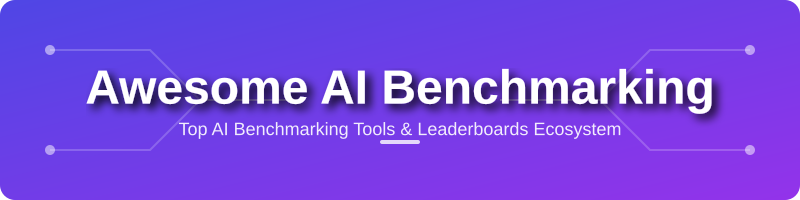

  

  # 🚀 Awesome AI Benchmarking
  ## 📊 Top AI Benchmarking Tools & Leaderboards Ecosystem

  
  
  
  
  

  
  **Curated List of SaaS Products & Open-Source GitHub Projects**  
  *Focused on LLM Evaluation, Benchmarking & Leaderboards*  
  **Last updated: May 2026**

  ---
  
  

    <b>Discover, compare, and deploy the world's best AI evaluation frameworks.</b>
     
    <i>Essential for AI Researchers, LLM Engineers, and Data Scientists.</i>
  

## 🌟 Introduction

This repository tracks notable **platforms** and **open-source projects** for **AI benchmarking and LLM evaluation**. These tools and leaderboards provide standardized, reproducible ways to measure model performance across reasoning, coding, knowledge, safety, instruction following, and real-world capabilities.

**Keywords:** LLM Evaluation, AI Benchmarking, Model Leaderboard, GPT-4 Benchmarks, LLM Metrics, Open Source AI, Evaluation Frameworks, RAG Evaluation, Code Generation Benchmarks.

**Examples** include LMSYS Chatbot Arena, Artificial Analysis, Open LLM Leaderboard (Hugging Face), Vellum LLM Leaderboard, and LiveBench (the category leaders). Tools listed here emphasize **rigorous evaluation**, human voting, automated metrics, contamination-free testing, and multi-dimensional scoring.

**Open-source emphasis**: This section is heavily expanded with every major active project for self-hosting, custom benchmarking, local evaluation, and full transparency — ideal for researchers, companies, and developers who want reproducible and auditable results.

Contributions welcome! Open a PR to add/update entries. Keep descriptions factual and link to official sites.

## 📚 Table of Contents
- [☁️ SaaS / Hosted Platforms](#-saas--hosted-platforms)
- [🛠️ Open-Source GitHub Projects](#️-open-source-github-projects)
- [🤝 How to Contribute](#-how-to-contribute)
- [⚠️ Disclaimer](#-disclaimer)

## ☁️ SaaS / Hosted Platforms

### 🏗️ Core Benchmarking Platforms & Leaderboards

- **[LMSYS Chatbot Arena](https://lmarena.ai/)** (formerly Chatbot Arena)  
  The most popular human-voted blind arena for comparing LLMs through crowdsourced Elo ratings. Highly trusted for real-world conversational ability.

- **[Artificial Analysis](https://artificialanalysis.ai/)**  
  Independent, high-quality benchmarking platform with detailed metrics on quality, speed, price, latency, and context window.

- **[AI Model Index](https://aimodelsindex.com/)**  
  Reconciles source-level evidence from major AI model leaderboards into transparent, auditable indexes with coverage, confidence, benchmark-version, and source-policy context.

- **[Open LLM Leaderboard (Hugging Face)](https://huggingface.co/spaces/open-llm-leaderboard/open_llm_leaderboard)**  
  The gold standard automated leaderboard for open models across multiple academic and reasoning benchmarks.

- **[LiveBench](https://livebench.ai/)**  
  Contamination-resistant benchmark with frequently updated questions to prevent data leakage.

- **[Vellum LLM Leaderboard](https://www.vellum.ai/llm-leaderboard)**  
  Enterprise-focused leaderboard with practical business use case evaluations.

### 🧪 Advanced & Specialized Platforms

**Other notable mentions**: Arena (various forks), HELM, BigBench, and industry-specific benchmarks (e.g., Legal, Medical, Finance).

## 🛠️ Open-Source GitHub Projects

### 📐 Dedicated Benchmarking & Evaluation Frameworks

- **[DeepEval](https://github.com/confident-ai/deepeval)**   
  Popular open-source framework for LLM evaluation with RAGAs, G-Eval, and custom metrics.
- **[lm-evaluation-harness](https://github.com/EleutherAI/lm-evaluation-harness)**   
  The most widely used open-source framework for evaluating LLMs. Supports dozens of benchmarks with standardized, reproducible evaluation.
- **[Big-Bench](https://github.com/google/BIG-bench)**   
  Google’s massive collaborative benchmark with over 200+ diverse tasks.
- **[HELM (Holistic Evaluation of Language Models)](https://github.com/stanford-crfm/helm)**   
  Stanford’s comprehensive benchmarking suite covering accuracy, calibration, robustness, fairness, bias, and toxicity.
- **[LightEval](https://github.com/huggingface/lighteval)**   
  Hugging Face’s lightweight and fast evaluation library optimized for large-scale benchmarking.
- **[EvalPlus](https://github.com/evalplus/evalplus)**   
  Rigorous evaluation framework focused on code generation with extended test cases (HumanEval+, MBPP+).
- **[LiveBench](https://github.com/livebench/livebench)**   
  Open-source contamination-free benchmark with regularly refreshed questions across multiple categories.
- **[StructEval](https://github.com/TIGER-AI-Lab/StructEval)**  
  TMLR benchmark for structured-output generation and conversion across 2,035 examples, 18 text and renderable visual formats, and 44 task types. [Paper](https://arxiv.org/abs/2505.20139) · [Leaderboard](https://tiger-ai-lab.github.io/StructEval/)
- **[DeepSWE](https://github.com/datacurve-ai/deep-swe)**   
  High-resolution benchmark from Datacurve for coding agents, featuring zero-pollution, long-horizon tasks across 100+ languages with behavioral verifiers.
- **[LangChain / LangSmith Evaluators](https://github.com/langchain-ai/langsmith-sdk)**   
  Production-grade evaluation tools with tracing and custom metric support.
- **[Open LLM Leaderboard](https://github.com/huggingface/open-llm-leaderboard)**   
  Official open-source codebase behind Hugging Face’s popular leaderboard. Fully customizable for running your own evaluations.

### Additional Strong Open-Source Options

- **[MT-Bench](https://github.com/lm-sys/FastChat)**  — Multi-turn conversation benchmarking (from LMSYS).
- **[RAGAS](https://github.com/explodinggradients/ragas)**  — Specialized framework for evaluating Retrieval-Augmented Generation systems.
- **[PromptBench](https://github.com/microsoft/promptbench)**  — Robustness and adversarial testing for prompts.
- **[ClawBench](https://github.com/reacher-z/ClawBench)**  — Live-website browser-agent benchmark; 283 everyday tasks (V1 153 + V2 130) across 163 live platforms. Two-stage scoring: HTTP-request interception at per-task URL/method schema + LLM judge on intercepted payload. [Paper](https://arxiv.org/abs/2604.08523) · [Live leaderboard](https://claw-bench.com).
- Many community forks and extensions of `lm-evaluation-harness` for domain-specific benchmarks (finance, legal, medical, etc.).
- **[SafetyBench](https://github.com/thu-coai/SafetyBench)**  — Safety and alignment evaluation suites.
- **[LLM-KG-Bench](https://github.com/AKSW/LLM-KG-Bench)**  — Knowledge graph and structured reasoning evaluation.
- **[VIrAL (Viral Intelligence and Risk Assessment Link)](https://github.com/QIANJINYDX/ViroBench)**  — Comprehensive benchmark for Nucleotide Foundation Models (NFMs) evaluating viral genomics understanding and latent biosecurity risks.
- **AgentBench** — For evaluating autonomous AI agents.

**Frameworks for building custom benchmarks**: Use **lm-evaluation-harness** + **LightEval** + **DeepEval** combined with **LangGraph** for comprehensive, reproducible evaluation pipelines that can run locally or at scale.

## 🤝 How to Contribute

1. Fork the repo.
2. Add/edit entries in `README.md` (follow existing format).
3. Include: name, link, 1–2 sentence description, and whether it's SaaS or open-source.
4. Submit PR with a short explanation.

**Star the repo if you find it useful!** ⭐

[⬆️ Back to Top](#-awesome-ai-benchmarking)

## ⚠️ Disclaimer

- This is a **community-curated** list — not exhaustive and not an endorsement.
- Benchmark scores can be misleading without understanding the methodology, contamination risks, and specific use cases. Always interpret results in context.
- Different benchmarks favor different model strengths — no single leaderboard tells the full story.

---

**Made with ❤️ for AI researchers, LLM engineers, product teams, and open-source enthusiasts.**  
*Let's make AI evaluation more transparent, rigorous, and reproducible.*

[⬆️ Back to Top](#-awesome-ai-benchmarking)

## 📈 Star History

  <a href="https://www.star-history.com/?repos=ishandutta2007%2FAwesome-AI-Benchmarking&type=date&legend=bottom-right">
   <picture>
     <source media="(prefers-color-scheme: dark)" srcset="https://api.star-history.com/chart?repos=ishandutta2007/Awesome-AI-Benchmarking&type=date&theme=dark&legend=bottom-right" />
     <source media="(prefers-color-scheme: light)" srcset="https://api.star-history.com/chart?repos=ishandutta2007/Awesome-AI-Benchmarking&type=date&legend=bottom-right" />
     
   </picture>
  </a>

